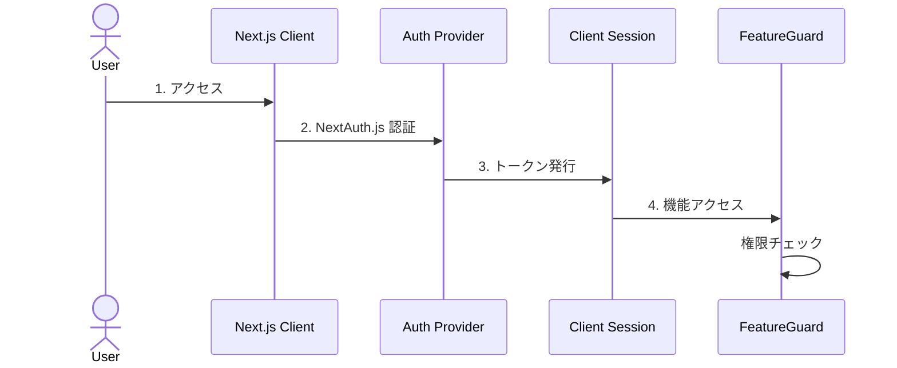
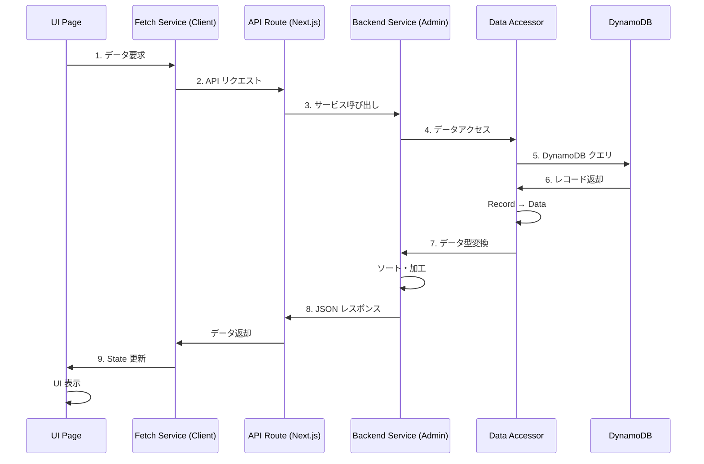
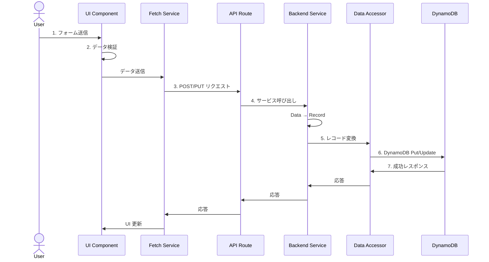
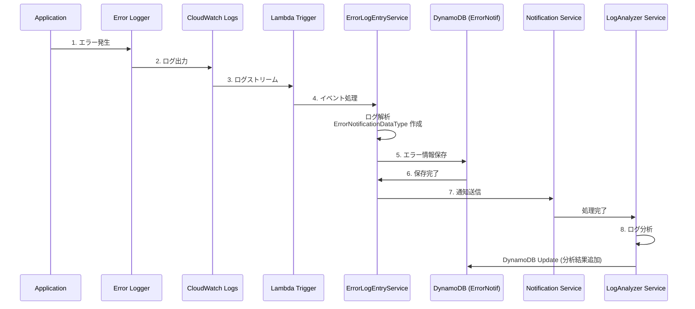
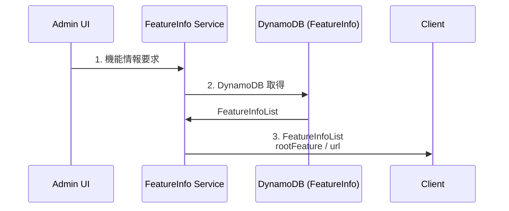

# データフロー

## 概要

このドキュメントでは、Admin システム内のデータフローと処理の流れを説明します。

## 主要なデータフロー

### 1. ユーザー認証フロー



**処理ステップ**:
1. ユーザーがアプリケーションにアクセス
2. NextAuth.js が認証プロバイダーと連携
3. 認証成功後、セッショントークンを発行
4. FeatureGuard コンポーネントが機能単位で権限チェック
5. 権限がある場合のみコンテンツを表示

### 2. データ取得フロー (Read)



**処理ステップ**:
1. UI コンポーネントがデータを要求 (例: `fetchService.get()`)
2. クライアントサイドの Fetch Service が API エンドポイントにリクエスト
3. Next.js API Route がリクエストを受信
4. Backend Service (AdminService, FeatureInfoService など) を呼び出し
5. Data Accessor が DynamoDB にクエリを実行
6. DynamoDB が Record 形式でデータを返却
7. Data Accessor が Record を Data 型に変換
8. Backend Service がデータを加工 (ソート、フィルタリングなど)
9. JSON レスポンスをクライアントに返却
10. Fetch Service が受信したデータで State を更新
11. React が UI を再レンダリング

### 3. データ作成/更新フロー (Create/Update)



**処理ステップ**:
1. ユーザーがフォームにデータを入力
2. UI コンポーネントがデータを検証
3. Fetch Service が POST/PUT リクエストを送信
4. API Route が Backend Service を呼び出し
5. Service が Data 型を Record 型に変換 (`dataToRecord()`)
6. Data Accessor が DynamoDB に書き込み
7. 成功レスポンスをクライアントに返却
8. UI が最新データで更新

### 4. エラー通知フロー



**処理ステップ**:
1. アプリケーションでエラーが発生
2. Error Logger が CloudWatch Logs にログを出力
3. CloudWatch Logs がログをストリーム
4. Lambda 関数がトリガーされる
5. ErrorLogEntryService がログを解析し、ErrorNotificationDataType を作成
6. DynamoDB にエラー情報を保存
7. ErrorNotificationService が通知を送信
8. LogAnalyzerService がログを分析し、結果を DynamoDB に保存
9. 管理者が UI でエラー通知を確認

### 5. 機能情報管理フロー



**FeatureInfo データ構造**:
```typescript
interface FeatureInfo {
  rootFeature: string;  // 例: "Admin"
  url: string;          // 例: "https://admin.example.com"
}
```

**用途**:
- 機能ごとの URL マッピング
- 動的ルーティング設定
- マルチテナント対応

## データ変換

### Record ↔ Data 変換

すべてのサービスは、DynamoDB の Record 型とアプリケーションの Data 型を相互変換します。

**変換の目的**:
- DynamoDB の命名規則 (PascalCase) とアプリケーションの命名規則 (camelCase) の統一
- 型安全性の確保
- ビジネスロジック層でのデータ整合性

**変換メソッド**:
```typescript
// Data → Record (書き込み時)
protected dataToRecord(data: Partial<DataType>): Partial<RecordType>

// Record → Data (読み込み時)
protected recordToData(record: RecordType): DataType
```

**例: AdminService の変換**:
```typescript
// Data → Record
dataToRecord(data: Partial<AdminDataType>): Partial<AdminRecordType> {
  return {
    TerminalIDList: data.terminalIdList || [],
  }
}

// Record → Data
recordToData(record: AdminRecordType): AdminDataType {
  return {
    id: record.ID || '',
    terminalIdList: record.TerminalIDList || [],
    create: record.Create || 0,
    update: record.Update || 0,
  }
}
```

## キャッシュ戦略

### キャッシュの有効化/無効化

サービスによってキャッシュ戦略が異なります：

**キャッシュ無効**:
- AdminService
- FeatureInfoService
- ErrorNotificationService

理由: 手動でのデータ書き換えの可能性があるため

**キャッシュ有効**:
- その他の参照頻度が高く、更新頻度が低いサービス

### キャッシュの実装

CRUDServiceBase でキャッシュを管理：
```typescript
constructor(dataAccessor: DataAccessor, useCache: boolean = true) {
  super(dataAccessor, useCache);
}
```

## エラーハンドリング

### クライアントサイド

- try-catch によるエラーキャッチ
- LoadingContent コンポーネントでのローディング状態管理
- エラー時の UI フィードバック

### サーバーサイド

- API Route でのエラーハンドリング
- 適切な HTTP ステータスコードの返却
- CloudWatch Logs へのエラーログ出力

### Lambda (Cloud Watch Trigger)

- 例外時のリトライ機構 (AWS Lambda 標準)
- Dead Letter Queue (DLQ) による失敗イベントの保管
- CloudWatch Logs へのエラー詳細出力
