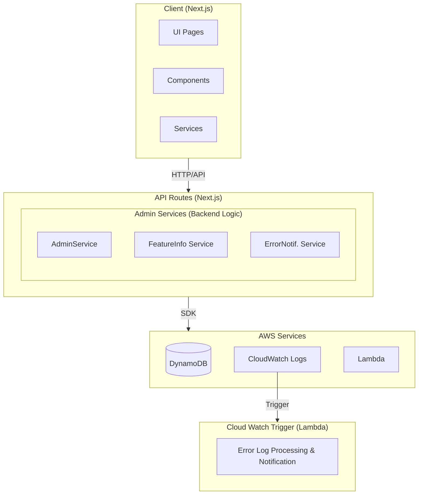

# システムアーキテクチャ

## 概要

Admin プロジェクトは、マイクロサービスアーキテクチャを採用したフルスタック Web アプリケーションです。

## アーキテクチャ図

## レイヤー構成

### 1. プレゼンテーション層 (Client)

**技術**: Next.js 15 (App Router), React 19, TypeScript

**責務**:
- ユーザーインターフェースの表示
- ユーザー入力の処理
- クライアントサイドルーティング
- 認証・認可の UI 制御

**主要コンポーネント**:
- `app/`: Next.js App Router によるページ定義
- `services/`: クライアントサイドのデータ取得サービス
- 共通コンポーネント (nextjs-common submodule より提供)

### 2. アプリケーション層 (Admin Backend)

**技術**: TypeScript, AWS SDK

**責務**:
- ビジネスロジックの実装
- データアクセスの抽象化
- データ変換 (Data ↔ Record)
- キャッシュ管理

**主要コンポーネント**:
- `services/`: ビジネスロジックを実装したサービスクラス
- `interfaces/`: データ型定義
- `utils/`: ユーティリティ関数
- `consts/`: 定数定義

**設計パターン**:
- サービス層パターン
- データアクセスオブジェクト (DAO) パターン
- CRUD 操作の共通化 (CRUDServiceBase)

### 3. データアクセス層 (Data Accessors)

**技術**: AWS SDK (DynamoDB)

**責務**:
- DynamoDB との通信
- CRUD 操作の実装
- データの永続化

**主要コンポーネント**:
- `services/*/DataAccessor.ts`: DynamoDB アクセス層

### 4. イベント処理層 (Cloud Watch Trigger)

**技術**: AWS Lambda, CloudWatch Logs

**責務**:
- CloudWatch Logs からのエラーログ処理
- エラー通知の作成
- ログ分析

**主要コンポーネント**:
- `index.ts`: Lambda ハンドラ
- `services/`: ログ処理サービス

## データストア

### DynamoDB テーブル

#### 1. Admin テーブル
- **用途**: 管理者情報の保存
- **キー**: ID (String)
- **属性**: 
  - TerminalIDList: 管理対象の端末 ID リスト
  - Create: 作成日時 (Unix timestamp)
  - Update: 更新日時 (Unix timestamp)

#### 2. FeatureInfo テーブル
- **用途**: 機能情報の管理
- **キー**: ID (String)
- **属性**:
  - FeatureInfoList: 機能情報リスト
  - Create: 作成日時
  - Update: 更新日時

#### 3. ErrorNotification テーブル
- **用途**: エラー通知の保存
- **キー**: ID (String)
- **属性**:
  - RootFeature: ルート機能名
  - Feature: 機能名
  - Message: エラーメッセージ
  - Stack: スタックトレース
  - AnalyzeResult: 分析結果 (オプション)
  - Create: 作成日時
  - Update: 更新日時

## 環境区分

システムは以下の環境で動作します：

- **local**: ローカル開発環境
- **development**: 開発環境
- **production**: 本番環境

環境に応じて DynamoDB テーブル名が切り替わります：
- development/local: `DevAdmin`
- production: `Admin`

## セキュリティ

### 認証・認可

- **NextAuth.js**: クライアント認証
- **FeatureGuard コンポーネント**: 機能単位のアクセス制御
- **PermissionLevel**: 権限レベル (VIEW, EDIT, ADMIN など)

### 環境変数管理

- AWS Secrets Manager による機密情報管理
- GitHub Secrets による CI/CD 環境変数管理

## スケーラビリティ

### 水平スケーリング

- **DynamoDB**: Auto Scaling によるスループット調整
- **Lambda**: 自動スケーリング

### キャッシュ戦略

- サービス層でのキャッシュ制御 (CRUDServiceBase)
- 手動更新可能性のあるデータはキャッシュ無効化

## 監視・ログ

### CloudWatch Logs

- アプリケーションログの集約
- エラーログの自動検出と通知

### エラー通知フロー

1. アプリケーションでエラー発生
2. CloudWatch Logs にログ出力
3. Lambda トリガー起動
4. エラーログの解析と通知作成
5. DynamoDB にエラー情報保存
6. 管理者が UI で確認

## 共通部品

### typescript-common (Submodule)

- 共通データ型 (DataTypeBase, RecordTypeBase)
- 共通サービス (CRUDServiceBase)
- 共通ユーティリティ (EnvironmentalUtil)

### nextjs-common (Submodule)

- UI コンポーネント (Table, Dialog, Button, TextField など)
- レイアウトコンポーネント (CommonLayout)
- 認証コンポーネント (FeatureGuard)
- データ取得コンポーネント (LoadingContent)

## デプロイメント

### ビルドプロセス

1. TypeScript コンパイル
2. 依存関係の解決
3. Docker イメージビルド (Lambda 用)
4. AWS へのデプロイ

### CI/CD

- GitHub Actions によるビルド・デプロイ自動化
- 環境別デプロイメント戦略
